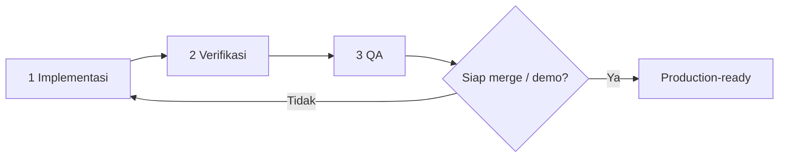

# Tessera — pipeline agent (Implementasi → Verifikasi → QA)

Dokumen ini mendefinisikan **tiga peran agent** di Cursor untuk menghasilkan kode yang **teruji** dan **siap produksi**, bukan sekadar «selesai di chat».

## Alur wajib



| Tahap | Peran | Skill / prompt | Keluaran |
|-------|--------|----------------|----------|
| 1 | **Implementasi** | `.cursor/skills/tessera-implementasi/SKILL.md` + `.cursor/prompts/implementasi-matang.md` | Kode + tes + ringkasan handoff |
| 2 | **Verifikasi** | `.cursor/skills/tessera-verifikasi/SKILL.md` | Laporan verifikasi (PASS/FAIL) + perbaikan atau daftar blokir |
| 3 | **QA** | `.cursor/skills/tessera-qa/SKILL.md` | Laporan QA akhir + keputusan merge/demo |

**Jangan** melewati tahap 2 atau 3 untuk deliverable hackathon, PR utama, atau fitur yang menyentuh jalur demo.

---

## Cara menjalankan di Cursor

### Opsi A — Satu chat berurutan (disarankan untuk satu fitur)

1. Buka chat Agent baru.
2. Tempel isi **`.cursor/prompts/implementasi-matang.md`** (isi bagian `TUGAS` dan `KRITERIA PENERIMAAN`).
3. Setelah agent selesai implementasi, kirim:

   ```
   @tessera-verifikasi — verifikasi hasil implementasi terakhir. Pakai handoff di atas.
   ```

4. Jika verifikasi **PASS**, kirim:

   ```
   @tessera-qa — QA akhir sebelum merge/demo.
   ```

5. Jika verifikasi **FAIL**, perbaiki di chat yang sama atau ulangi dari tahap 1 dengan daftar temuan.

### Opsi B — Tiga chat terpisah (isolasi konteks)

| Chat | Buka dengan |
|------|-------------|
| Implementasi | Prompt matang + skill `@tessera-implementasi` |
| Verifikasi | Chat baru: `@tessera-verifikasi` + salin **Handoff Implementasi** dari chat 1 |
| QA | Chat baru: `@tessera-qa` + salin **Laporan Verifikasi** dari chat 2 |

### Opsi C — Subagent / Task (paralel terbatas)

Parent agent boleh memanggil subagent `explore` atau `shell` **hanya** untuk riset atau menjalankan skrip; **keputusan PASS/FAIL** tetap di agent Verifikasi dan QA sesuai skill masing-masing.

---

## Definisi «production-ready» (Tessera)

Semua ini harus benar kecuali blokir luar terdokumentasi di `docs/HACKATHON_BLOCKERS.md`:

- `./scripts/verify.sh` hijau
- `./scripts/verify-full.sh` hijau jika perubahan menyentuh build Next / konfigurasi produksi / PR utama
- Tidak ada `skip` / `xfail` / `pytest -k` selektif untuk «hijau palsu»
- Tes baru untuk perilaku yang diubah (bukan assert kosong)
- Variabel/komentar baru mengikuti CONTRIBUTING (Bahasa Indonesia)
- Tidak ada secret di diff; `.env` tidak di-commit
- QA: smoke manual sesuai `docs/VERIFY.md` untuk area yang disentuh

Detail: `docs/AGENT_PIPELINE.md`, `docs/VERIFY.md`, `docs/HACKATHON_QUALITY_BAR.md`.

---

## File terkait

| File | Fungsi |
|------|--------|
| `.cursor/prompts/implementasi-matang.md` | Template prompt tugas (copy-paste) |
| `.cursor/prompts/handoff-verifikasi.md` | Template handoff ke agent Verifikasi |
| `.cursor/prompts/handoff-qa.md` | Template handoff ke agent QA |
| `.cursor/skills/tessera-implementasi/SKILL.md` | Instruksi agent implementasi |
| `.cursor/skills/tessera-verifikasi/SKILL.md` | Instruksi agent verifikasi |
| `.cursor/skills/tessera-qa/SKILL.md` | Instruksi agent QA |
| `.cursor/rules/tessera-pipeline.mdc` | Pengingat pipeline di workspace |
